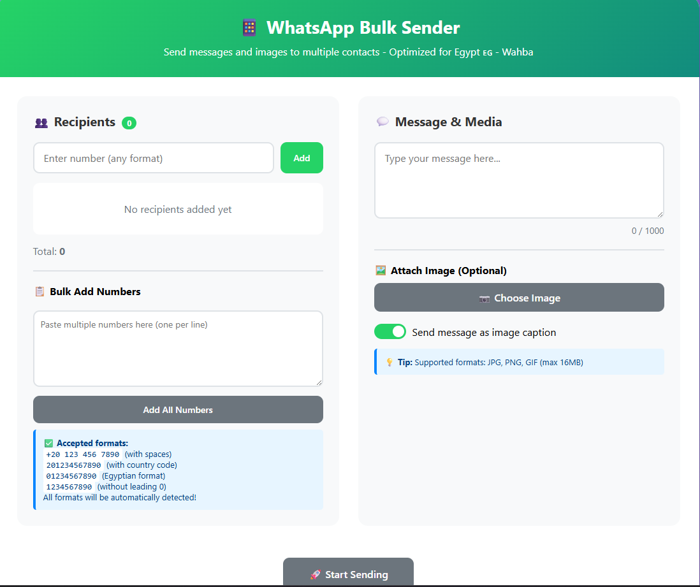
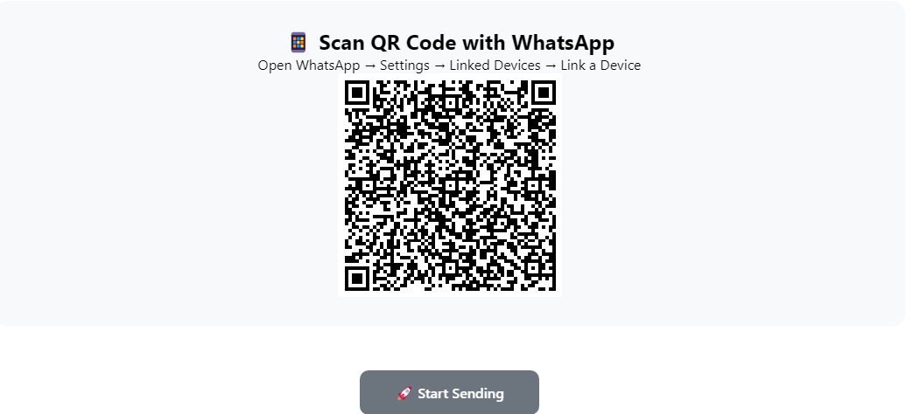
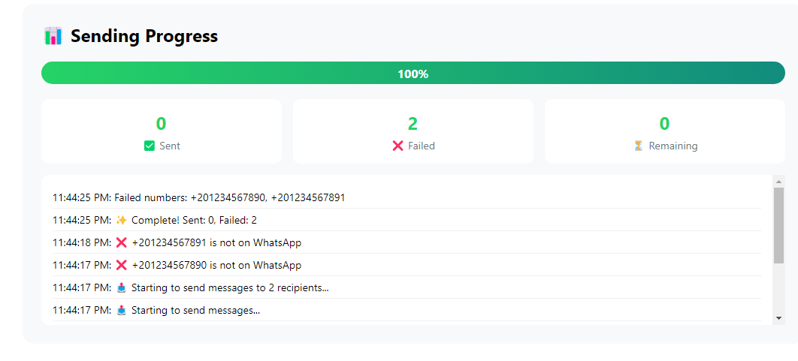

# WhatsApp Bulk Sender (Egypt 🇪🇬 +20)

<!DOCTYPE html>
<html lang="en">
<head>
  <meta charset="UTF-8">
</head>
<body>

<h1>📦 WhatsApp Bulk Sender (Egypt)</h1>

  A desktop app built with <strong>Electron</strong> + <strong>whatsapp-web.js</strong> for sending bulk WhatsApp messages (text &amp; images). 
  Pre-configured with Egypt’s <code>+20</code> country code.

  
  
  

⚠️ <strong>Note:</strong> <code>node_modules</code> is <em>not</em> included in this repo. Run <code>npm install</code> after cloning.

<h2>✨ Features</h2>
<ul>
  <li>Bulk messaging with <strong>text or images</strong></li>
  <li>QR code login via <strong>WhatsApp Web</strong></li>
  <li>Real-time <strong>status updates</strong> and <strong>progress tracking</strong></li>
  <li><strong>Egypt default</strong> country code (<code>+20</code>)</li>
  <li>Electron-based desktop app (Windows, macOS, Linux)</li>
</ul>

<h2>🖼️ Screenshots</h2>
<h3>Main UI (country code prefilled as +20)</h3>

<h3>QR Code Login</h3>

<h3>Sending Status</h3>

<em>Numbers not registered on WhatsApp are automatically detected and skipped.</em>

<h2>🛠 Installation</h2>

<pre><code># 1) clone
git clone https://github.com/realwahba/whatsapp-bulk-sender-EG.git
cd whatsapp-bulk-sender-egypt

# 2) install dependencies (node_modules not included)
npm install

# 3) start in development
npm start
</code></pre>

On first run, scan the QR code with WhatsApp (<em>Linked devices</em>) to authenticate.

<h2>⚙️ Scripts</h2>

<pre><code># start app (with GPU fixes)
npm start

# start app in "safe" mode
npm run start-safe

# build for Windows installer (nsis)
npm run build-win

# build for all platforms (requires setup)
npm run build
</code></pre>

<h2>🔐 Notes &amp; Warnings</h2>
<ul>
  <li>Automating WhatsApp may violate WhatsApp’s Terms of Service. Use responsibly.</li>
  <li>Send messages only to contacts who opted in.</li>
  <li>WhatsApp may temporarily block or ban accounts for spammy usage.</li>
</ul>

<h2>📄 License</h2>

MIT © 2025 <a href="https://github.com/Realwahba">Realwahba</a>

</body>
</html>

git clone https://github.com/realwahba/whatsapp-bulk-sender-EG.git
cd whatsapp-bulk-sender-EG
